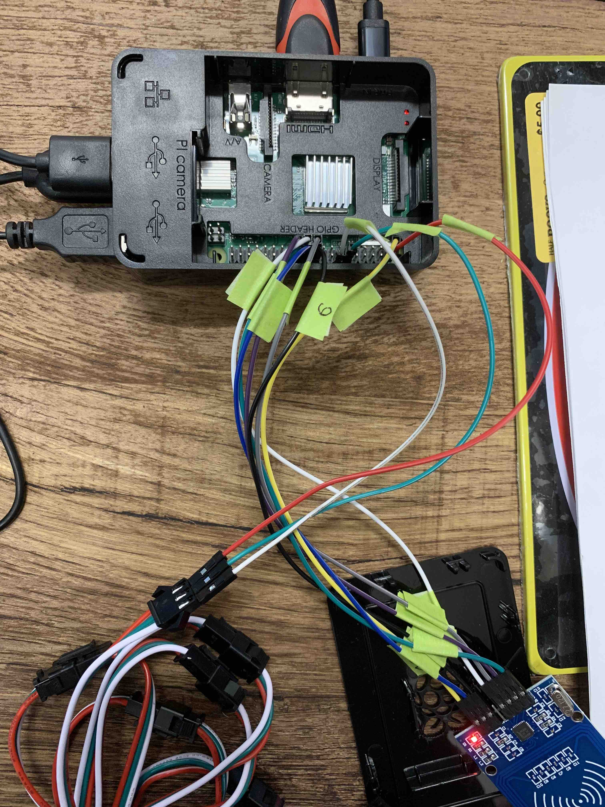

# RFIDTapPoint


# Preparation & Installation:

1. Update our Raspberry Pi:
```
sudo apt-get update
sudo apt-get upgrade
sudo apt-get install python3-dev python3-pip
sudo pip3 install spidev
```
2. Install the MFRC522 library to your Raspberry Pi using pip:
```
sudo pip3 install mfrc522
```
3. Install Pyrebase:
```
sudo pip3 install pyrebase
sudo pip3 install --upgrade google-auth-oauthlib
```
4. We install the required packages for WS281x:
```
sudo apt-get install gcc make build-essential python-dev git scons swig
```
Notes: if you run into problem spi package could not be uninstalled, please find and remove it from the script so the installation will go through.

5. Now we can download the library
```
git clone https://github.com/jgarff/rpi_ws281x
```
In this directory are on the one hand some C files included, which can be easily compiled. In order to use them in Python, we need to compile them:
```
cd rpi_ws281x/
sudo scons
```
6. Switch to the Python folder and carry out the installation:
```
cd python
sudo python3 setup.py build
sudo python3 setup.py install
```


Done! Now we should be able to clone or download RFIDTapPoint repo above to the desired location and run:
```
cd RFIDTapPoint/
sudo python3 Read.py
```

# Run on startup:
1. Edit the file /etc/rc.local:
```
sudo nano /etc/rc.local
```
Add commands to execute the python program at the bottom, replace the path to /home/pi/your-path/Read.py
```
sudo python3 /home/pi/RFIDTapPoint-master/Read.py &
exit 0
```
Press Ctrl-O -> Enter to save then Ctrl-X to exit nano

# Instructions on Wiring

# LED Light Strip WS2812B to GPIO:

DI connects to Pin 12. (GPIO 18)

5V connects to Pin 2. (or any 5V)

GND connects to Pin 14. (or any GND)




# RFID RC522 Chip to GPIO:

SDA connects to Pin 24.

SCK connects to Pin 23.

MOSI connects to Pin 19.

MISO connects to Pin 21.

GND connects to Pin 6.

RST connects to Pin 22.

3.3v connects to Pin 1.

# Audio not playing on USB Speaker:

Open sudo nano /usr/share/alsa/alsa.conf and look for the following two lines:
```
defaults.ctl.card 0
defaults.pcm.card 0
```
Change both “0” to “1” and then save the file.
```
defaults.ctl.card 1
defaults.pcm.card 1
```
# References:

How to setup a Raspberry Pi RFID RC522 Chip:

https://pimylifeup.com/raspberry-pi-rfid-rc522/

Connect and Control WS2812 RGB LED Strips via Raspberry Pi:

https://tutorials-raspberrypi.com/connect-control-raspberry-pi-ws2812-rgb-led-strips/


